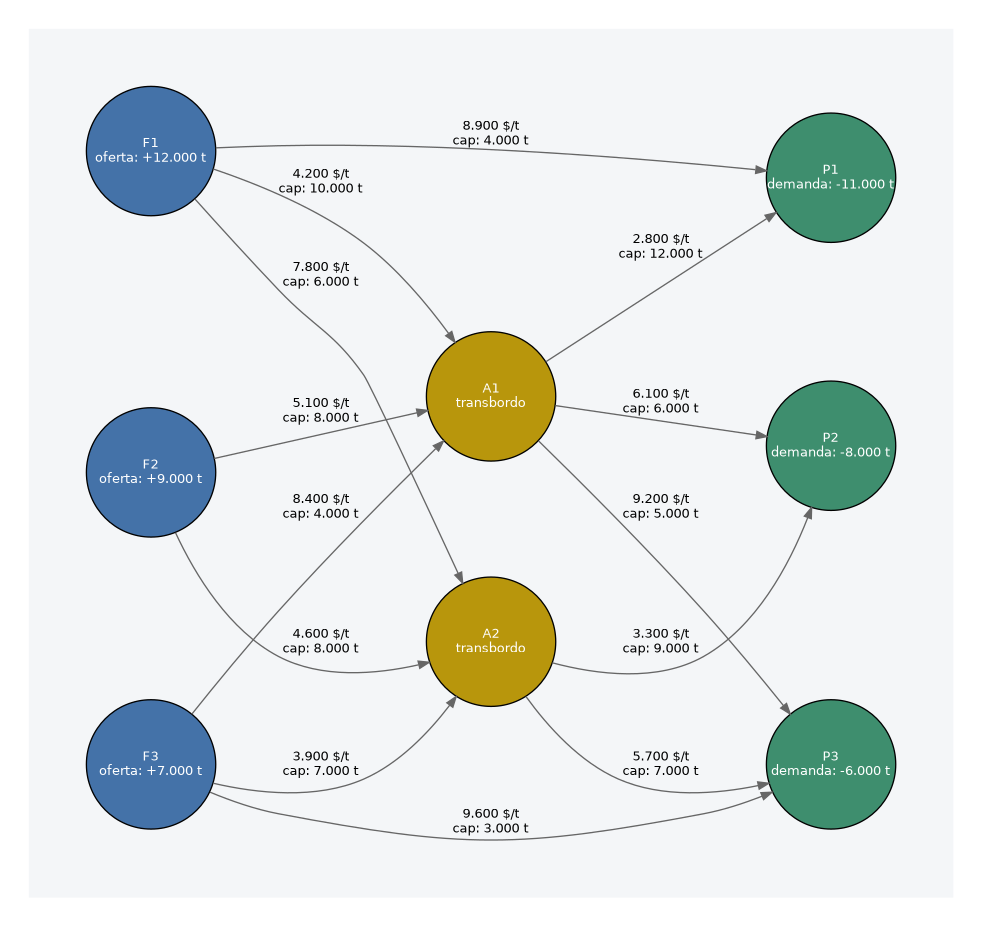

# Taller 1: Formulación y Optimización de Red de Flujo a Costo Mínimo
**Programa:** Doctorado en Ingeniería (UV–UTA)  
**Asignatura:** DIG07 Investigación de Operaciones
Profesor: Schulze, E.
**Fecha:** Septiembre 2026

## 🚀 Descripción del Proyecto

Este repositorio contiene la solución para el problema de optimización de la red de logística minera. El objetivo principal es determinar el plan de despacho mensual de mínimo costo desde las faenas concentradoras hasta los puertos de exportación, transitando por acopios intermedios.

El modelo está formulado como un Problema de Flujo a Costo Mínimo (Min-Cost Network Flow) implementado en Pyomo y resuelto mediante HiGHS./

 (Fuente: Elaboración propia)

 (Fuente: Elaboración propia)


## 🛠️ Cómo ejecutar
Para ejecutar el proyecto, asegúrate de tener Python 3.10+ y los siguientes paquetes instalados:
pip install pyomo pandas numpy highs networkx

Instrucciones de Ejecución
Opción 1: Ejecutar el Cuaderno Jupyter (Recomendado)
Abre cuaderno.ipynb en tu entorno de Jupyter Notebook o VS Code y ejecuta todas las celdas en orden (Run All). El cuaderno procesará los datos, resolverá la red y generará los archivos en la carpeta resultados/.

Opción 2: Ejecutar desde la consola
También puedes correr el notebook directamente desde la terminal: jupyter execute cuaderno.ipynb

## 👥 Integrantes
+ Pasmiño, Catherinne
+ Jara, Felipe
+ Arriagada, Jorge

Control de Versiones e Historial de Commits: El trabajo fue desarrollado en colaboración continua mediante un flujo de trabajo basado en git


## Instancia asignada
+ Minería
+  (Fuente: https://www.nuevamineria.com/revista/costos-de-la-mineria-del-cobre-en-chile-se-han-incrementado-66-en-los-ultimos-cinco-anos/)


# 📁 Estructura del Repositorio
```text
Taller1/
├── README.md           # Cómo ejecutar, integrantes e instancia asignada
├── cuaderno.ipynb      # Desarrollo, verificación y respuestas
├── modelo.py           # Formulación en Pyomo, sin datos incrustados
├── datos/              # Los CSV entregados, sin modificar
│   ├── nodos.csv
│   └── arcos.csv
└── resultados/
    ├── solucion.csv    # Flujos óptimos arco por arco
    └── duales.csv      # Valores duales de los nodos


